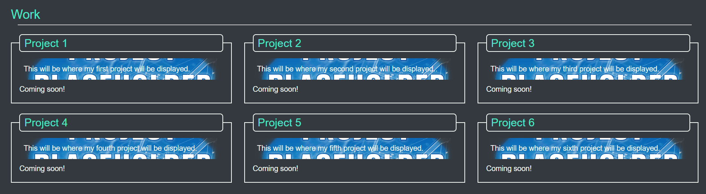

# 02 Advanced CSS: Portfolio

## Description

This is my first step in building my personal and professional projects portfolio, so far it has been constructed using only HTML and CSS, while a work in progress it will be something that I plan to keep improving as I learn new things and skills, while also building new projects to add to it.

## Usage

For ease of use the navigation bar includes links to each section, as shown in the picture below:

The "About Me" section tells you a bit more about myself, about where I come from and where I´m headed professionalwise.

The "Work" section will show in small windows a preview of my project and talking about these projects, I´ll add them as I build them, while also improving the aesthetics of the portfolio. This section currently has only placeholder images and Coming soon! messages and is show briefly in the picture below.

After these comes the "Resume" section, which contains more details about my professional path and experience so far.

Finally comes the "Contact" section, which contains all of my contact information!

## Credits

This was mostly done by myself, using some inspiration from the code from the Advanced CSS module´s Mini Project of the coding bootcamp I´m taking.